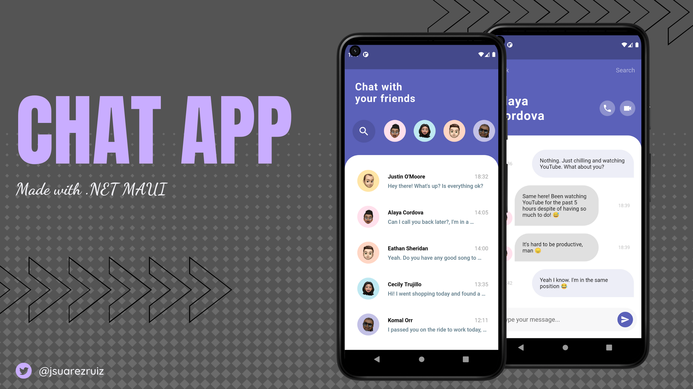
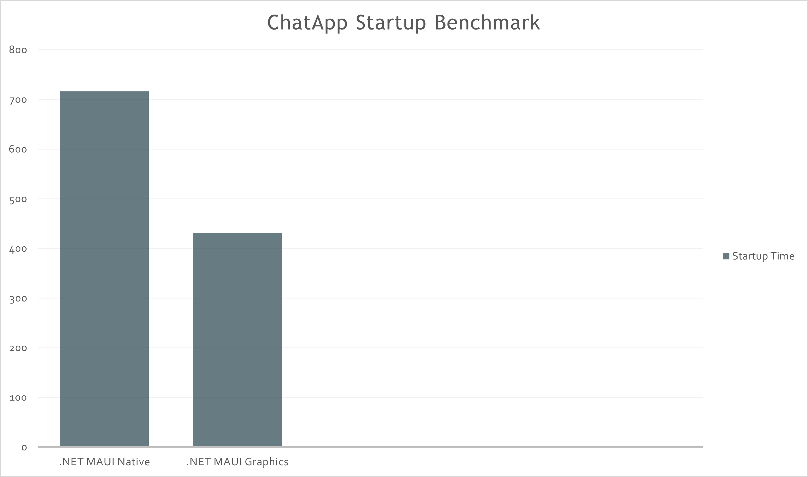
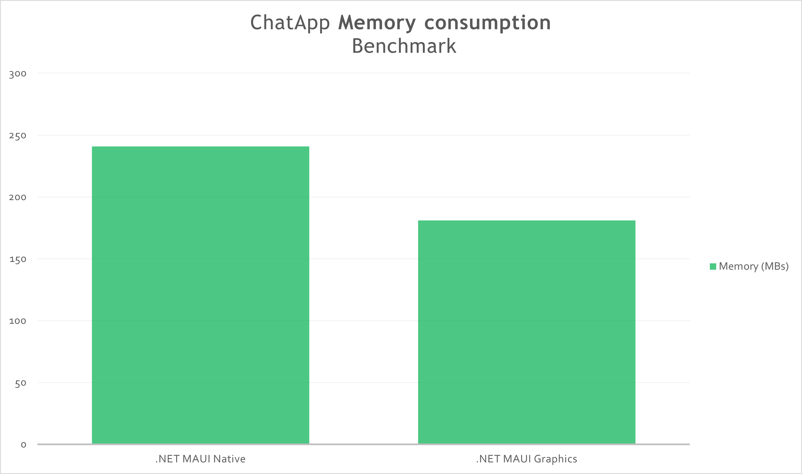

# ChatApp Challenge using .NET MAUI Graphics

Chat App UI Challenge made with .NET MAUI Graphics. The entire user interface is rendered using .NET MAUI Graphics. The App has a single native view that creates a Canvas where we draw everything.

Based on this [design](https://dribbble.com/shots/11470136-A-Messaging-App-Concept) by [Tannaz Sadeghi](https://dribbble.com/tannazsadeghi).

## Benchmarks

Next, we have a comparison between the same [App created with .NET MAUI](https://github.com/jsuarezruiz/netmaui-chat-app-challenge) (native controls) and a version created entirely with MAUI Graphics.

_NOTE: A Poco F2 Pro has been used to obtain the data._

#### Startup time

| Android App | Framework           | Profiled AOT Time (ms) |
|-------------|---------------------| ---------------------:|
| ChatApp    |  .NET MAUI GA SR1 (Native Views)         |                716.9 |
| ChatApp    |  .NET MAUI GA SR1 (Drawn Views)          |                432.1 |

(lower values are better)

#### Memory consumption

| Android App | Framework           | Profiled AOT Time(MBs) |
|-------------|---------------------| ---------------------:|
| ChatApp    |  .NET MAUI GA SR1 (Native Views)         |                240.876 |
| ChatApp    |  .NET MAUI GA SR1 (Drawn Views)          |                180.890 |

(lower values are better)

## Copyright and license

Code released under the [MIT license](https://opensource.org/licenses/MIT).